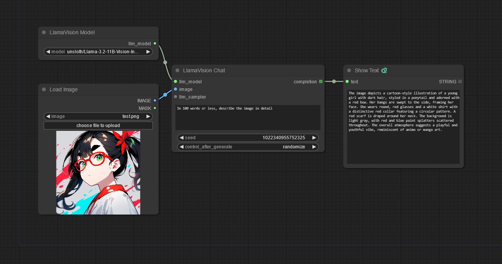

# (Yet Another) Llama Vision Node for ComfyUI

A set of nodes for basic Llama 3.2 Vision support in ComfyUI. Give it an image and query and it will output a text response.

(The "Show Text" node is from https://github.com/pythongosssss/ComfyUI-Custom-Scripts/)

For the moment, the LLM sampler nodes can be found in my https://github.com/asaddi/ComfyUI-YALLM-node project. They are completely optional and the defaults for the model will be used if there's nothing connected (usually this means: temperature 0.6, top-p 0.9).

## Installation

Clone into your `custom_nodes` directory and install the dependencies:

    path/to/ComfyUI/pip install -r YALLM-LlamaVision/requirements.txt

This will upgrade your Huggingface `transformers` module to 4.45 or later, which is needed for Llama 3.2 Vision. It will also install the HF `bitsandbytes` package for running quantized (e.g. nf4) models.

## Models

Out of the box, it uses the nf4 quantized model at https://huggingface.co/unsloth/Llama-3.2-11B-Vision-Instruct-bnb-4bit (for best results, you should probably have at least 10GB of VRAM).

Other options are available, including the original unquantized (BF16) version.

See `models.yaml.default` for details. By default, models are downloaded into the `models/LLM` directory within ComfyUI. I know some people (including myself) like having them download into their Huggingface cache (`~/.cache/huggingface`) instead, where they can be easily shared with other projects/notebooks. This can be enabled on a per-model basis.

You can customize the model list by:

    cp models.yaml.default models.yaml

and then editing `models.yaml` to taste.

Also, no, I haven't tested it with 90B!

## License

Licensed under [BSD-2-Clause-Patent](https://opensource.org/license/bsdpluspatent).
